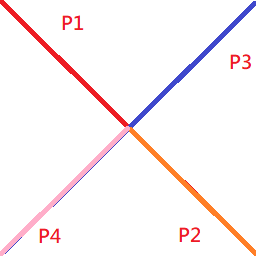

# Road-Analysis

## 通用篇

### 正確的路網

錯誤的路網，十字路口需切成四段，若只有兩條線，P1只能連通P2，P3只能連通P4，P1無法連通P3。

正確的路網，十字路口切成四段，P1~P4都能互相連通。

## O'view 篇

### 匯入道路向量

1. 安裝Scene Producer
    + 安裝T_SceneProducer.exe，一直按Next完成，安裝完可試用30天。

1. 新增專案
    + 啟動Scene Producer，上方選單->File->New GPJ...，設置座標如下圖後完成。(會產生多檔案故建議將GPJ存檔於新增資料夾中)

    
1. 加入道路圖層
    + 上方選單->File->Open File...->選取道路.shp檔，會轉檔成.gdb檔後加入專案中。

    

### 產生道路圖層
1. .gdb是一般向量圖層，在此我們需將.gdb轉檔成.ndb才可做路網分析。
1. 左邊Layer Control點選道路圖層後，上方選單->Layer->New Layer...->New NDB Layer
1. 選取路名欄位與存檔路徑後按下Ok進行轉檔。
    
1. 產生完畢後，點選道路圖層，可於上方選單->Tool->Newwork Analysis做最短路徑分析
    

### 產生O'view PGV圖層
1. .ndb是二維圖層，我們需將其轉換成三維圖層以供O'view 使用，步驟如下:
1. 雙擊.ndb圖層，於3D Vector頁籤勾選Enable Vector Display in 3D View後確定。
    
1. 上方選單->File->3D O'view->External Layer Maker->Vector...，選取地形.tdf檔，勾選道路圖層，雙擊Road選取路名欄位，設置圖層名稱後確定進行轉檔。
    
1. 轉檔完成後得到 .pgv .atr兩個檔案。

### 於O'view Express 中進行道路分析

1. 開啟O'view Express，左側圖層列表Vector右鍵 Add Local Layer...選取.pgv即可檢視。
    
1. 上方選單->Analysis->Shortest Path... 即可進行最短路徑分析
    

### 於O'view SDK 中開發道路分析

#### 最短路徑

## O'view Map Server 篇

### 匯入道路向量

### 產生道路圖層
